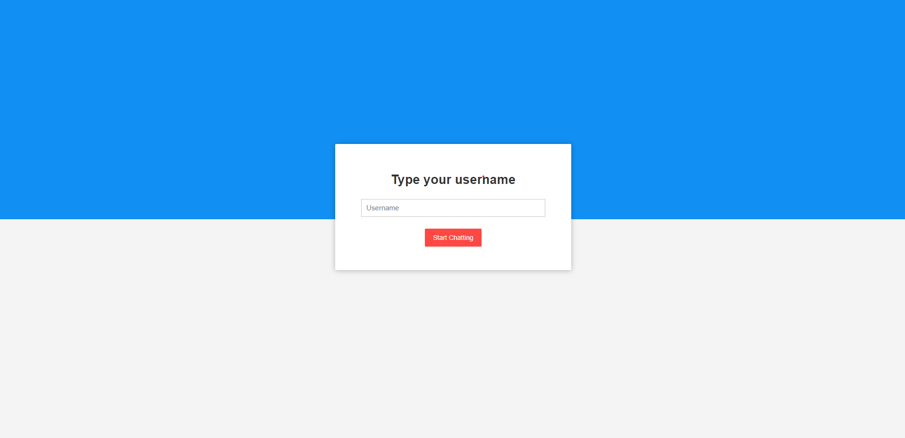
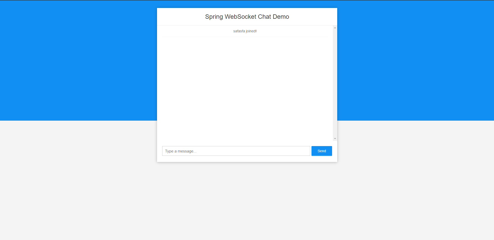

 ### Personal project Kotlin and Spring Boot WebSocket on a simple interactive chat

 # Getting started
 
Use the command below for start the application

```
mvn spring-boot:run
```

# API endpoints

To access the site just enter the url [localhost](http://localhost:8080/) and enter your username



Type on message in chat public


# Built With

* [Kotlin](https://kotlinlang.org/) - The programming language that does more with less code
* [SpringBoot](https://spring.io/projects/spring-boot/) - A lightweight web framework for Java and Kotlin
* [WebSocket](https://spring.io/guides/gs/messaging-stomp-websocket/) - WebSocket for create a interative web application
* [Maven](https://gradle.org/) - More than just a building toolkit
